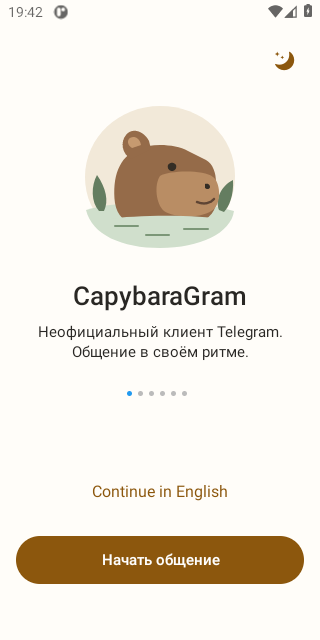
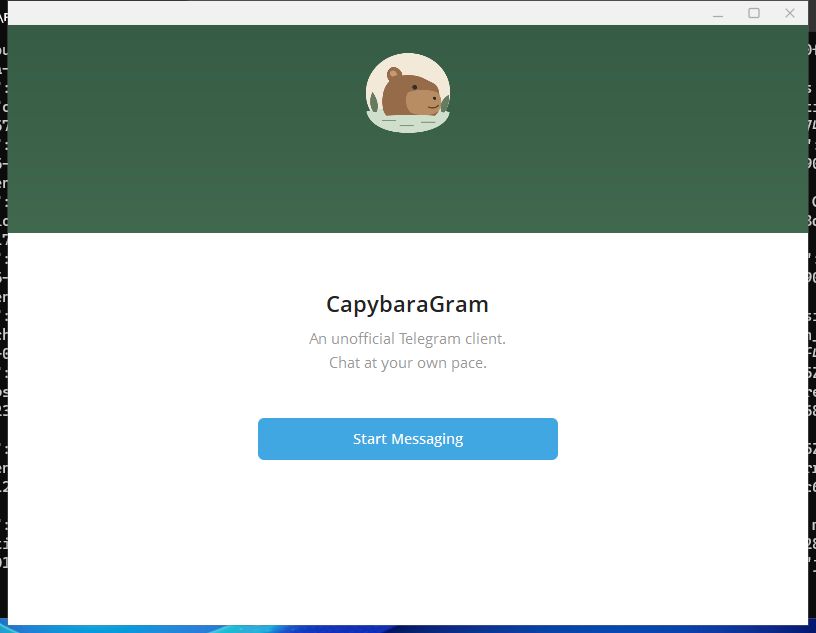
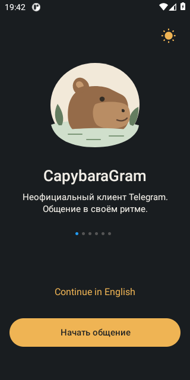
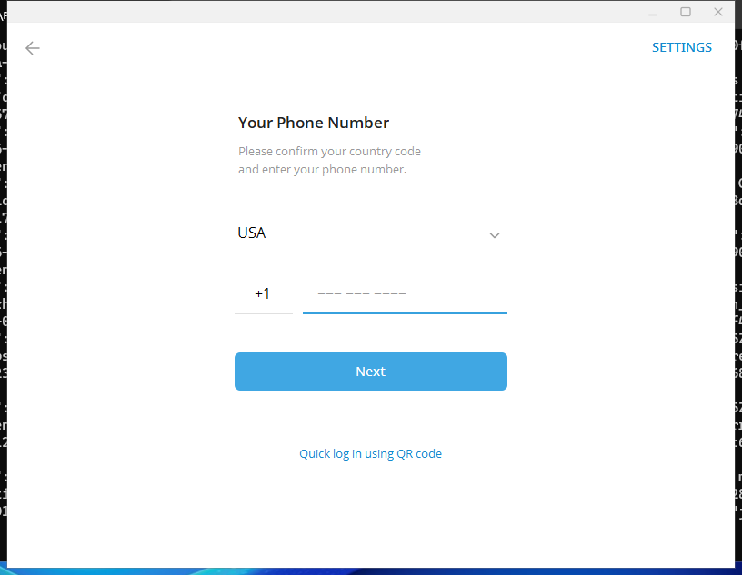

<h1 align="center">CapybaraGram</h1>

<strong>Неофициальный Telegram-клиент для Android и Windows</strong> Личные заметки, подготовленные ответы и управление несколькими аккаунтами.

<a href="#что-уже-сделано">Возможности</a> · <a href="#как-выглядит-приложение">Скриншоты</a> · <a href="docs/ARCHITECTURE.md">Архитектура</a> · <a href="docs/VERIFICATION.md">Проверки</a> · <a href="docs/BUILDING.md">Сборка</a>

---

**Статус: активная разработка, рабочие тестовые сборки.** Android APK и Windows Release EXE собраны; установка и стартовые сценарии проверены. Полная приёмка функций на реальных аккаунтах продолжается. Это ещё не стабильный публичный релиз.

## О проекте

CapybaraGram развивает привычный Telegram в сторону личного рабочего пространства: сохранить контекст разговора в заметке, подготовить ответ из шаблона, разделить несколько аккаунтов и управлять подтверждениями прочтения.

Основа — официальные открытые исходники Telegram. В этом репозитории находятся **собственные модули, изменения исходников, тесты и сборочные процессы**. Исходники Android и Windows загружаются из закреплённых upstream-версий при сборке. Это два нативных приложения, а не веб-оболочка и не полностью написанный с нуля мессенджер.

Проект ведёт [AlbertBoss](https://github.com/AlbertBoss). CapybaraGram не является официальным продуктом Telegram.

## Новое оформление

В код добавлены **Capybara Light / Capybara Dark**: тёплая светлая и графитовая тёмная темы с янтарными акцентами. Изменения затрагивают список чатов, переписку, меню и настройки. В шапке чата появилась отдельная кнопка доступа к инструментам CapybaraGram.

Android с новой палитрой собран и прошёл стартовую проверку; ниже уже показаны его реальные экраны. Обновлённая Windows-версия ещё собирается. Небольшая дополнительная правка цвета индикатора страниц Android проходит повторную сборку. [Как устроено оформление и что перенесено из концепта](docs/APPEARANCE.md).

## Как выглядит приложение

Ниже — **реальные снимки тестовых сборок**, сделанные на чистых тестовых устройствах без входа в аккаунт. Android показан с новой палитрой, Windows — в предыдущей проверенной сборке. Работу функций внутри чата эти снимки не подтверждают.

<table>
<tr><th>Android · новое оформление</th><th>Windows · предыдущая сборка</th></tr>
<tr>
<td align="center"></td>
<td align="center"></td>
</tr>
</table>

Ещё два экрана: тёмная тема Android и вход по номеру на Windows

Новая тёмная тема Android и форма входа предыдущей Windows-сборки. Поле номера пустое; настоящие аккаунты не использовались.

 

[Происхождение скриншотов](docs/images/README.md).

## Что уже сделано

«Есть в сборке» означает наличие скомпилированного кода. Проверка на настоящих аккаунтах — отдельный этап.

| Возможность | Android | Windows | Подтверждение и границы |
| --- | --- | --- | --- |
| Личные заметки к чату или теме | Есть в сборке | Есть в сборке | Хранилища и жизненный цикл проверены; приёмка редакторов в клиенте продолжается |
| Шаблоны: создание, просмотр, вставка в черновик | Есть в сборке | Есть в сборке | Код интерфейса и хранения собран; отправка остаётся отдельным действием пользователя |
| 10 локальных слотов аккаунтов | Есть в сборке | Есть в сборке | Изменения скомпилированы; десять одновременно авторизованных аккаунтов ещё не проверены |
| Обработка ответов и ошибок сервера при изменении папок | Есть в сборке | Есть в сборке | Контролируемые тесты; двусторонняя синхронизация с официальным клиентом требует живой проверки |
| «Нечиталка»: подавление подтверждений прочтения | Первая реализация в APK | В плане | Тесты политики, адаптера и запросов; сетевое поведение на двух аккаунтах ещё не принято |
| Установка и запуск | APK: проверены | EXE и установщик: проверены | Стартовые экраны, пустая форма входа; перезапуск Android, установка и замена Windows |

Заметки и шаблоны **хранятся на конкретном устройстве**; их синхронизации пока нет. Серверные лимиты Telegram и доступ к Premium этим клиентом не отменяются.

## Инженерная часть

- **Нативная интеграция:** Java и Android API; C++ и Qt на Windows. Функции подключаются к существующим чатам, аккаунтам и жизненному циклу приложения.
- **Локальные данные:** SQLite, AES-GCM и Android Keystore на Android; DPAPI, реестр владельцев и фоновая работа с хранилищем на Windows.
- **Изоляция запросов:** разрешение на явное прочтение связано с конкретным запросом и сессией. Выход делает старые разрешения недействительными.
- **Контроль исходников:** преобразования проверяют исходные и итоговые хеши; неожиданные изменения основы останавливают подготовку.
- **Проверка готовых файлов:** архитектура, подпись Android, параметры манифеста, установка и нативные экраны, помимо тестов модулей.

Это результаты конкретных проверок, а не заявление об отсутствии всех уязвимостей. [Архитектура и ограничения](docs/ARCHITECTURE.md) · [Подтверждения](docs/VERIFICATION.md).

## Сборки и проверки

| Артефакт / сценарий | Проверенный запуск |
| --- | --- |
| Android ARM64 APK с новым оформлением и первой реализацией «нечиталки» | [Сборка 34154803384](https://github.com/AlbertBoss/capybaragram-build/actions/runs/34154803384) |
| Android: установка, стартовые экраны и перезапуск | [Проверка 34156405310](https://github.com/AlbertBoss/capybaragram-build/actions/runs/34156405310) |
| Windows x64 Release EXE | [Сборка 34031740962](https://github.com/AlbertBoss/capybaragram-build/actions/runs/34031740962) |
| Windows: переход к пустой форме входа | [Проверка 34059187270](https://github.com/AlbertBoss/capybaragram-build/actions/runs/34059187270) |
| Windows: установщик, замена и сохранность тестовых файлов | [Проверка 34060238891](https://github.com/AlbertBoss/capybaragram-build/actions/runs/34060238891) |

Стабильные релизы ещё не опубликованы. Артефакты Actions временные: ссылки показывают историю проверок, а не постоянный каталог скачивания. [Как собрать приложение](docs/BUILDING.md).

## Что дальше

Приоритет — приёмка повседневных сценариев на обеих платформах: сообщения, медиа, аккаунты, заметки, шаблоны, папки, уведомления и сохранение входа при обновлении. Сейчас также проверяется новое оформление и готовится скачиваемая тестовая версия для обеих платформ. Расширение функций приватности, истории и голоса остаётся следующим этапом.

Полная «нечиталка» секретных чатов, архив удалённых и исчезающих сообщений, локальная транскрипция и улучшение подключения **ещё не готовы**. [План разработки](docs/ROADMAP.md).

## Документация и код

- [Первые шаги: установка, темы, заметки и шаблоны](docs/QUICKSTART.md)
- [Оформление и доступ к инструментам чата](docs/APPEARANCE.md)
- [Архитектура и карта собственных модулей](docs/ARCHITECTURE.md)
- [Подтверждённые результаты и границы тестирования](docs/VERIFICATION.md)
- [Подготовка и запуск сборки](docs/BUILDING.md)
- [Следующие этапы](docs/ROADMAP.md)
- [История изменений](https://github.com/AlbertBoss/capybaragram-build/commits/main/) · [Сообщить об ошибке](https://github.com/AlbertBoss/capybaragram-build/issues)

## Основа и лицензии

| Платформа | Закреплённые исходники |
| --- | --- |
| Android | [DrKLO/Telegram · 62b56a0](https://github.com/DrKLO/Telegram/tree/62b56a07ca7e30e39f7fd00a6728d6bbd716ca1c) |
| Windows | [telegramdesktop/tdesktop · 8015898](https://github.com/telegramdesktop/tdesktop/tree/80158983dba09d3bf5d96701f21473d6c34bf5f5) |

Собственные сборочные скрипты распространяются по [MIT](LICENSE). Исходники Telegram, производные приложения и сторонние компоненты сохраняют исходные лицензии и уведомления; MIT этого репозитория не меняет лицензии Telegram. Соответствующие исходники и лицензии входят в требования к итоговой поставке.

## English summary

**CapybaraGram is an unofficial native Telegram client for Android and Windows, under active development.** This repository contains custom modules, source transformations, tests and build workflows against pinned Telegram sources. Current builds include local chat notes, reply templates and ten account slots; Android also includes an initial silent-read implementation. Native startup and installer checks have passed. Real-account feature acceptance, the final interface and a stable public release remain in progress.
